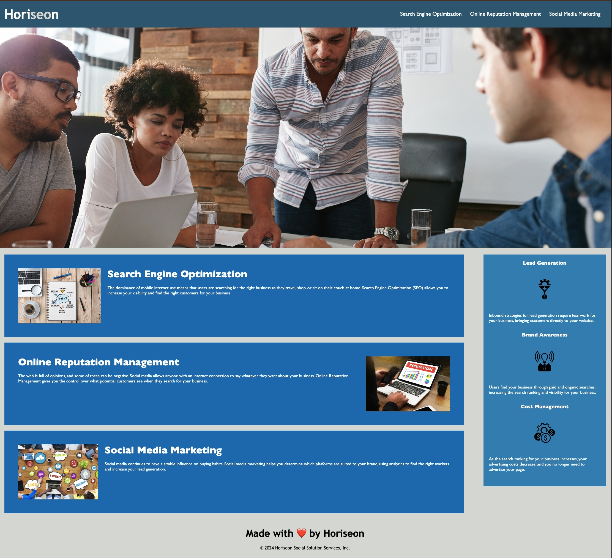

# Horiseon-accessibility

## Description

This webpage was refactored in order to add in accessibility features for a marketing agency client to optimize their webpage for search engines to drive more views and business. Below you will find the user story and acceptance criteria for the project and a mockup image of the finished product.

## User Story

```
AS A marketing agency
I WANT a codebase that follows accessibility standards
SO THAT our own site is optimized for search engines
```

## Acceptance Criteria

```
GIVEN a webpage meets accessibility standards
WHEN I view the source code
THEN I find semantic HTML elements
WHEN I view the structure of the HTML elements
THEN I find that the elements follow a logical structure independent of styling and positioning
WHEN I view the icon and image elements
THEN I find accessible alt attributes
WHEN I view the heading attributes
THEN they fall in sequential order
WHEN I view the title element
THEN I find a concise, descriptive title
```

## Mock-Up

The following image shows the web application's appearance and functionality:

